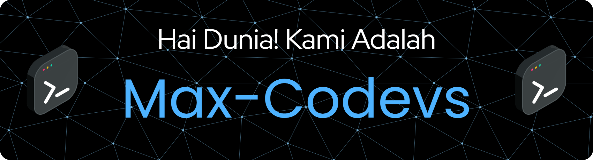

<h1 align="center">
  🚀 Welcome to Max-Codevs 👋
</h1>

  

---

## 🌟 Tentang Kami  
Kami adalah **Max-Codevs** — tim developer penuh semangat yang membangun project dari **Frontend, Backend, hingga Software Development**! 🎯  

- 💻 **Fullstack Web Development** (Frontend & Backend)  
- 🖥️ **Software Development** dengan **C#** & **Java**  
- 🌱 Sedang mendalami **Laravel, React, dan AI Tools**  
- 🤝 Terbuka untuk kolaborasi pada project **Open Source & Komersial**  
- ⚡ Fun fact: Kami lebih sering *debugging* daripada tidur 😆  

---

## 🛠️ Tech Stack  

  

  

---

## 🎯 Visi & Misi  

✨ Menjadi tim **Fullstack & Software Developer** yang handal.  
🌍 Membuat **Open-Source Tools** bermanfaat untuk komunitas IT.  
🤝 Memperluas **kolaborasi internasional** di dunia teknologi.  
🚀 Terus berkembang dan siap menghadapi tantangan masa depan.  

---

## 🏆 Achievements

  

---

## 📊 Statistik GitHub  

  
  

  

---

## 📈 Contribution Graph  

  

---

## 📌 GitHub Insights  

  
  
  
  
  

---

## 🎮 Fun Animation Zone  

  
  

---

## 📊 Visitor Counter & Profile Views  

  
  

---

## 🌐 Connect with Us  

  
  

---

✨ <b>Max-Codevs369</b> — Coding, Creating, Animating & Collaborating for the Future 🚀

