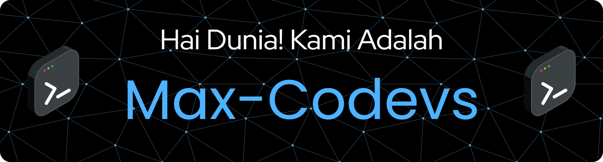

# Max-Codevs

---

## Tentang Kami

Kami adalah **Max-Codevs**, tim developer yang membangun project mulai dari **frontend**, **backend**, hingga **software development**.

- Fullstack Web Development (Frontend & Backend)
- Software Development dengan **C#**, **Java**, dan **C**
- Menguasai **Laravel**, **React**, **Next.js**, **Go**, dan **AI Tools**
- Terbiasa bekerja dengan **PostgreSQL** dan **GORM** untuk database layer
- Terbuka untuk kolaborasi pada project open source maupun komersial

---

## Tech Stack

---

## Visi & Misi

- Menjadi tim fullstack dan software developer yang handal
- Membangun open-source tools yang bermanfaat bagi komunitas IT
- Memperluas kolaborasi internasional di dunia teknologi
- Terus berkembang dan siap menghadapi tantangan masa depan

---

## Statistik GitHub

---

## Contribution Graph

---

## GitHub Insights

---

## Statistik Kunjungan

---

## Hubungi Kami

---

<b>Max-Codevs</b> — Coding, Creating, and Collaborating for the Future

